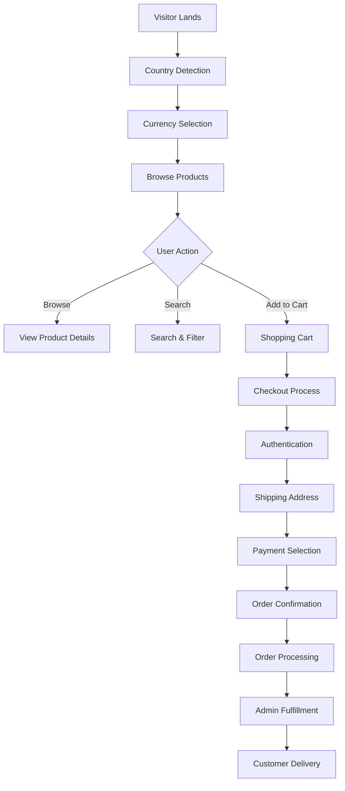

# Shanfa Global E-commerce Platform - Technical Analysis

## Executive Summary
This document provides a comprehensive technical analysis of the Shanfa Global e-commerce platform, covering architecture, potential problems, security vulnerabilities, and the complete application workflow. The analysis is based on examination of the codebase structure, configuration files, and implementation patterns.

## 1. Application Architecture Overview

### 1.1 Technology Stack
- **Framework:** Next.js 16.1.6 with App Router
- **Language:** TypeScript
- **Database:** MongoDB with Prisma ORM
- **Authentication:** NextAuth.js with MFA support
- **Styling:** Tailwind CSS
- **State Management:** Zustand
- **Payment Processing:** Stripe, Tabby, Tamara
- **Deployment:** Vercel
- **Email:** Resend with React Email templates

### 1.2 Project Structure
```
ecommerce-next/
├── src/
│   ├── app/                    # Next.js App Router pages
│   │   ├── api/               # API routes
│   │   ├── auth/              # Authentication pages
│   │   ├── account/           # User account management
│   │   ├── ueadmin/           # Admin panel
│   │   └── [various pages]    # Public pages
│   ├── components/            # Reusable UI components
│   ├── lib/                   # Utility libraries
│   └── services/              # Business logic services
├── prisma/                    # Database schema
├── public/                    # Static assets
└── plans/                     # Documentation & planning
```

### 1.3 Data Model (Key Entities)
- **User:** Multi-role (USER, ADMIN, SUPERADMIN) with MFA
- **Store:** Multi-store support (UAE, Kuwait, etc.)
- **Product:** Multi-variant, multi-store inventory
- **Order:** Complex workflow with multiple statuses
- **Payment:** Multiple payment method integration
- **Courier:** Country-specific delivery configuration

## 2. Potential Problems & Complexities

### 2.1 Technical Debt & Code Quality Issues

#### 2.1.1 Type Safety Concerns
- **Issue:** Extensive use of `as any` type assertions in authentication logic
- **Location:** `src/lib/auth.ts` lines 50, 58, 66, 82, 88
- **Impact:** Loss of TypeScript benefits, potential runtime errors
- **Complexity:** Medium - Requires refactoring with proper types

#### 2.1.2 Mixed Database Patterns
- **Issue:** MongoDB with Prisma (relational patterns on document DB)
- **Impact:** Potential performance issues with complex joins
- **Complexity:** High - Schema design may not leverage MongoDB strengths

#### 2.1.3 Authentication Complexity
- **Issue:** Overly complex MFA and admin approval system
- **Impact:** Maintenance burden, potential security gaps
- **Complexity:** High - Multiple authentication flows to maintain

### 2.2 Performance Concerns

#### 2.2.1 Database Query Patterns
- **Issue:** N+1 query patterns possible in product listings
- **Evidence:** Multiple `Promise.all()` calls in data fetching
- **Impact:** Slow page loads with scale

#### 2.2.2 Image Optimization
- **Issue:** `dangerouslyAllowSVG: true` in Next.js config
- **Impact:** Security risk, though mitigated by CSP
- **Complexity:** Low - Configuration change needed

#### 2.2.3 Bundle Size
- **Issue:** Multiple large dependencies (Stripe, GSAP, Framer Motion)
- **Impact:** Increased initial load time
- **Complexity:** Medium - Requires code splitting optimization

### 2.3 Business Logic Complexities

#### 2.3.1 Multi-Store Inventory Management
- **Issue:** Complex inventory tracking across stores (UAE, Kuwait)
- **Feedback Reference:** FB-036
- **Impact:** Synchronization challenges, stock accuracy issues
- **Complexity:** High - Requires careful transaction management

#### 2.3.2 Multi-Currency & Pricing
- **Issue:** Fractional pricing not working for some currencies
- **Feedback Reference:** FB-035
- **Impact:** Pricing display errors, checkout issues
- **Complexity:** Medium - Currency formatting logic needs fixing

#### 2.3.3 Country-Specific Delivery Rules
- **Issue:** Complex delivery fee structure across 7+ countries
- **Feedback Reference:** FB-019 to FB-024
- **Impact:** Configuration management overhead
- **Complexity:** High - Business rule complexity

## 3. Security Vulnerabilities & Issues

### 3.1 Critical Security Concerns

#### 3.1.1 Authentication Bypass Risk
- **Issue:** `masterAdminBypass` flag in token (line 93, middleware.ts)
- **Location:** `middleware.ts`
- **Risk:** Potential privilege escalation if token compromised
- **Severity:** High - Requires careful audit of bypass logic

#### 3.1.2 Website Lock Mechanism
- **Issue:** Custom lock system with secret path
- **Risk:** If secret path leaked, entire site can be unlocked
- **Severity:** Medium - Depends on secret management

#### 3.1.3 API Security
- **Issue:** Some API routes may lack proper authorization
- **Evidence:** Feedback FB-013 mentions "Unauthorized" errors
- **Risk:** Data exposure or unauthorized actions
- **Severity:** High - Requires comprehensive API audit

### 3.2 Medium Security Concerns

#### 3.2.1 Session Management
- **Issue:** Mixed cookie configuration for production/development
- **Location:** `src/lib/auth.ts` lines 24-38
- **Risk:** Session fixation or theft if misconfigured
- **Severity:** Medium - Configuration-dependent

#### 3.2.2 Password Security
- **Issue:** bcryptjs used but configuration unknown
- **Risk:** Weak hashing if low cost factor
- **Severity:** Medium - Requires configuration review

#### 3.2.3 MFA Implementation
- **Issue:** Custom MFA token system vs. standard TOTP
- **Risk:** Potential flaws in token generation/validation
- **Severity:** Medium - Requires security review

### 3.3 Low Security Concerns

#### 3.3.1 CSP Configuration
- **Issue:** Content Security Policy in Next.js config
- **Risk:** XSS vulnerabilities if CSP too permissive
- **Severity:** Low - CSP is implemented but needs review

#### 3.3.2 Error Handling
- **Issue:** Detailed error messages in production
- **Risk:** Information disclosure
- **Severity:** Low - `removeConsole` is enabled in production

## 4. Full Web Application Working Logic & Processes

### 4.1 User Journey Flow



### 4.2 Authentication & Authorization Flow

#### 4.2.1 Regular User Authentication
1. User visits `/auth/sign-in`
2. Enters email/password
3. Credentials validated via `bcryptjs`
4. Session token created via NextAuth
5. Redirect to intended page

#### 4.2.2 Admin Authentication (Enhanced)
1. Admin visits `/ueadmin/login`
2. Enters credentials
3. MFA token generated and sent via email
4. Admin enters MFA token
5. Super admin approval may be required
6. Session established with role-based permissions

#### 4.2.3 Authorization Middleware
- **Path:** `middleware.ts` (322 lines)
- **Logic:** Role-based route protection
- **Features:** Website lock, admin panel activation control
- **Complexity:** High with multiple conditional checks

### 4.3 Product Management Flow

#### 4.3.1 Product Display Logic
1. Homepage fetches products via `getProducts()` and `getNewArrivals()`
2. Products filtered by country/currency
3. Pricing adjusted based on currency exchange
4. Inventory checked per store
5. Display with appropriate badges (Hot Item, Trending, etc.)

#### 4.3.2 Admin Product Management
1. Admin navigates to `/ueadmin/products/add`
2. Uses `AddProductForm.tsx` component
3. Product data saved with multi-store inventory
4. Images uploaded to Cloudinary
5. Product attributes set (category, skin type, concerns)

### 4.4 Order Processing Pipeline

#### 4.4.1 Order Creation
1. Customer completes checkout
2. Order created with status `PENDING_PAYMENT`
3. Payment processed via selected gateway
4. On success, status moves to `PAID`

#### 4.4.2 Order Fulfillment
1. Admin views order in `/ueadmin/orders/[id]`
2. Updates status through `OrderStatusActions.tsx`
3. Courier assigned based on country
4. Tracking information added
5. Status progresses through defined workflow

#### 4.4.3 Order Status States
```
PENDING_PAYMENT → PAID → PROCESSING → READY_FOR_PICKUP → 
ORDER_PICKED_UP → IN_TRANSIT → DELIVERED
```
Alternative paths: `CANCELLED` or `REFUNDED`

### 4.5 Payment Processing Integration

#### 4.5.1 Payment Method Flow
1. Customer selects payment method at checkout
2. Corresponding payment service invoked:
   - **Stripe:** `/api/payments/stripe/create-intent`
   - **Tabby:** Tabby payment service
   - **Tamara:** `/api/payments/tamara/create-session`
   - **Cash on Delivery:** Direct order creation
3. Payment confirmation via webhook
4. Order status updated accordingly

#### 4.5.2 Multi-Currency Handling
1. Country detection via IP or manual selection
2. Currency conversion using fixed rates or API
3. Amount formatting per locale
4. Payment gateway currency configuration

### 4.6 Inventory & Multi-Store Management

#### 4.6.1 Inventory Synchronization
- **Challenge:** Stock levels across UAE and Kuwait stores
- **Solution:** `StoreInventory` model with store-specific quantities
- **Process:** Deduct from appropriate store on order placement
- **Complexity:** Requires atomic operations to prevent overselling

#### 4.6.2 Price Management
- **Base Price:** Set in AED (UAE Dirham)
- **Conversion:** Automatic to other currencies
- **Rounding:** Business rules for fractional amounts
- **Display:** Currency-specific formatting

## 5. Development & Maintenance Challenges

### 5.1 Build & Deployment Complexities

#### 5.1.1 Environment Configuration
- **Issue:** Multiple environment variables required
- **Count:** 20+ critical environment variables
- **Risk:** Misconfiguration causing runtime failures
- **Mitigation:** Comprehensive documentation needed

#### 5.1.2 Database Migrations
- **Issue:** MongoDB with Prisma migration challenges
- **Risk:** Schema drift in production
- **Complexity:** Manual intervention often required

### 5.2 Testing Challenges

#### 5.2.1 Test Coverage
- **Current State:** Limited test files observed
- **Risk:** Regression bugs with new features
- **Recommendation:** Implement comprehensive test suite

#### 5.2.2 Integration Testing
- **Challenge:** Multiple external services (payment, email, courier)
- **Complexity:** Mocking required for reliable tests
- **Priority:** High for payment-related functionality

### 5.3 Scalability Considerations

#### 5.3.1 Database Scaling
- **Current:** Single MongoDB instance
- **Limitation:** Connection pooling, query optimization needed
- **Future:** Sharding may be required for multi-region

#### 5.3.2 Application Scaling
- **Architecture:** Stateless Next.js app suitable for horizontal scaling
- **Bottleneck:** Database connections, external API rate limits
- **Optimization:** Caching strategy implementation needed

## 6. Recommendations & Action Plan

### 6.1 Immediate Actions (Security & Stability)

1. **Security Audit:** Comprehensive review of authentication and authorization logic
2. **API Protection:** Ensure all API routes have proper authorization
3. **Error Handling:** Implement consistent error handling without information disclosure
4. **Logging:** Enhance security event logging for audit trails

### 6.2 Short-term Improvements (1-2 Months)

1. **Type Safety:** Remove `as any` assertions with proper TypeScript interfaces
2. **Performance:** Implement caching for product data and currency rates
3. **Testing:** Develop unit and integration test suite
4. **Documentation:** Complete API and architecture documentation

### 6.3 Medium-term Enhancements (3-6 Months)

1. **Architecture Refinement:** Consider microservices for payment and inventory
2. **Monitoring:** Implement comprehensive application monitoring
3. **CI/CD:** Enhance deployment pipeline with automated testing
4. **Internationalization:** Complete multi-language support

### 6.4 Long-term Strategy (6+ Months)

1. **Scalability:** Database sharding and read replicas
2. **Resilience:** Multi-region deployment for disaster recovery
3. **Advanced Features:** AI recommendations, predictive inventory
4. **Mobile App:** Native mobile application development

## 7. Risk Assessment Matrix

| Risk Category | Likelihood | Impact | Severity | Mitigation Strategy |
|--------------|------------|---------|----------|---------------------|
| Authentication Bypass | Low | High | High | Regular security audits, penetration testing |
| Payment Processing Failure | Medium | High | High | Comprehensive testing, fallback payment methods |
| Inventory Synchronization Issues | High | Medium | High | Transaction locking, real-time validation |
| Multi-Currency Pricing Errors | High | Medium | High | Automated tests for currency conversions |
| Database Performance Degradation | Medium | High | High | Query optimization, indexing strategy |
| Third-party Service Outages | Medium | High | High | Circuit breakers, fallback mechanisms |

## 8. Conclusion

The Shanfa Global e-commerce platform is a complex, feature-rich application with sophisticated requirements for multi-store operations, multi-currency support, and advanced authentication. While the architecture is generally sound using modern technologies, several areas require attention:

1. **Security** needs strengthening, particularly around authentication and API protection
2. **Code quality** improvements are needed, especially for type safety
3. **Performance** optimization should be prioritized as the catalog grows
4. **Testing** infrastructure is currently insufficient for reliable deployments

The platform has a solid foundation but requires focused effort on technical debt reduction and security hardening to ensure long-term stability and scalability.

---

**Document Control**
- **Created:** [Current Date]
- **Last Updated:** [Current Date]
- **Version:** 1.0
- **Author:** Technical Analysis Team
- **Status:** For Review

**Appendices**
- A: Database Schema Diagram
- B: API Endpoint Catalog
- C: Environment Variables Reference
- D: Deployment Checklist